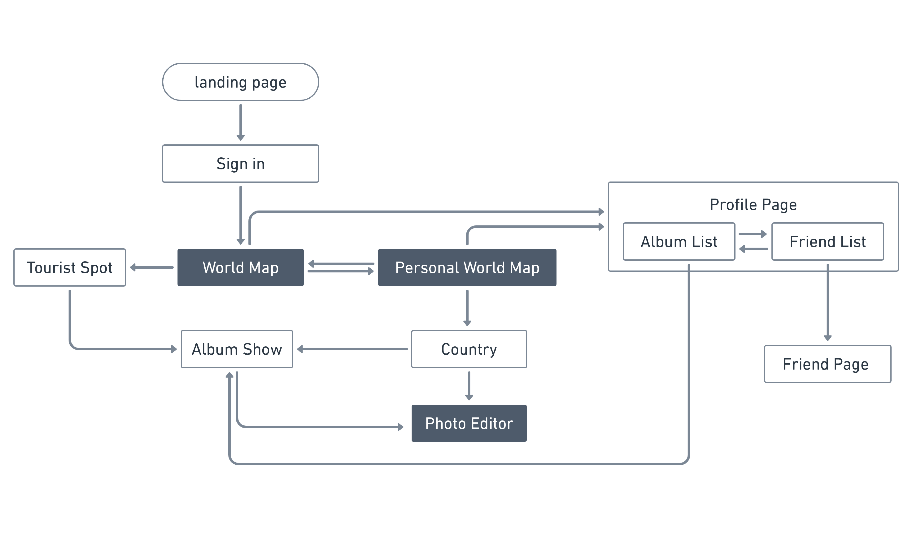

#  World from Home
> An album editor which makes it easy for users to arrange photos from traveling and share their wonderful albums with the community.
## Introduction 
+ Present the traveling trends on the map.
+ Label the countries you've been to your personal world map.
+ Create your onw distinguishing and gorgeous albums using the album editor, and see the ones from others as well. 
+ Establish friendship to other menbers.

## Link
Website Link: <https://world-from-home.web.app/> 
Click right now and go from home to world !  
Please login with your google account for full experiences.

## Techniques
+ Front-End Fundamental
  + HTML / CSS / JavaScript
  + Responsive Web Design (RWD)
+ Frameworks & Library
  + React (Hooks)
  + React Router
  + Redux
+ Firebase
  + Authentication
  + Firestore
  + Hosting
+ Packages
  + leaflet
  + react-leaflet
  + react-leaflet-markercluster
  + esri-leaflet
  + esri-leaflet-geocoder
  + OpenstreetMap
  + fabric
  + compressor
  + styled-components
  + material UI
  + sweetalert2
+ Other
  + CI / CD: GitHub Actions
  + Lint Tool: ESLint / Prettier
  + Version Control : Git / GitHub
  + Unit Test: Jest

## Flow Chart

## Demo
### World Map Section 
+ This map show the tourist spots labled from users.  As the map zoom in, these spots will spread and show the pop up window after clicking.
&emsp; 
+ Switching to my world, show the information and albums of the country after clicking it or use the search box. 
&emsp;
### Edit Section
+ In edit section, use the tools at left side to create new template, and upload image or add text into the board.  After editing, upload the cover photo and label the tourist spots.
&emsp;
### Profile Page Section
+ Display personal information, all albums you created and your friend in profile page.
&emsp;
+ Manage friends in friend section.
&emsp;

## Contact
+ Author: Viggo Chang
+ E-mail: <gl4cj8686@gmail.com> 